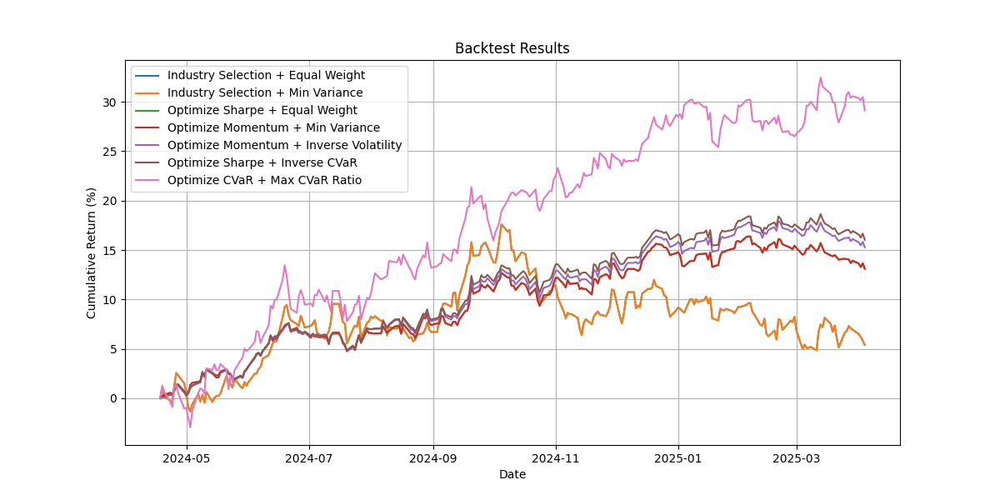
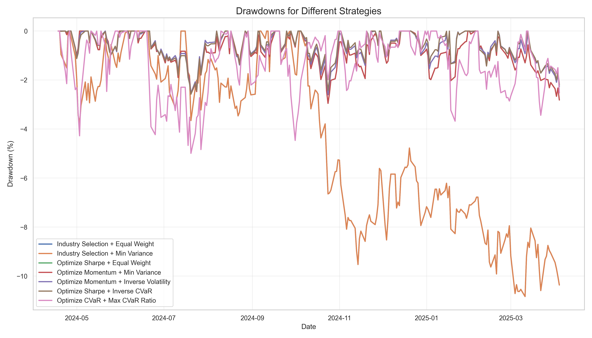
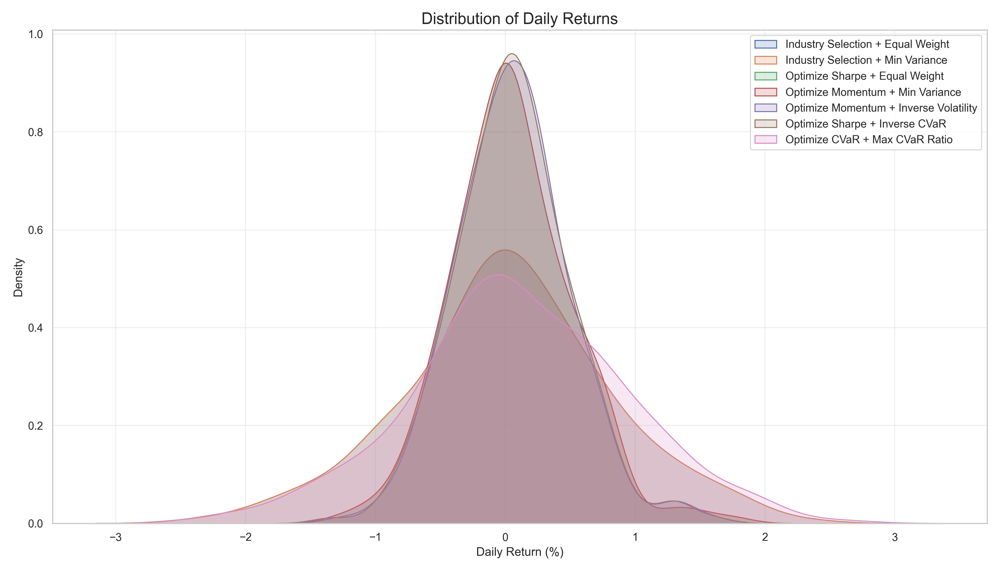
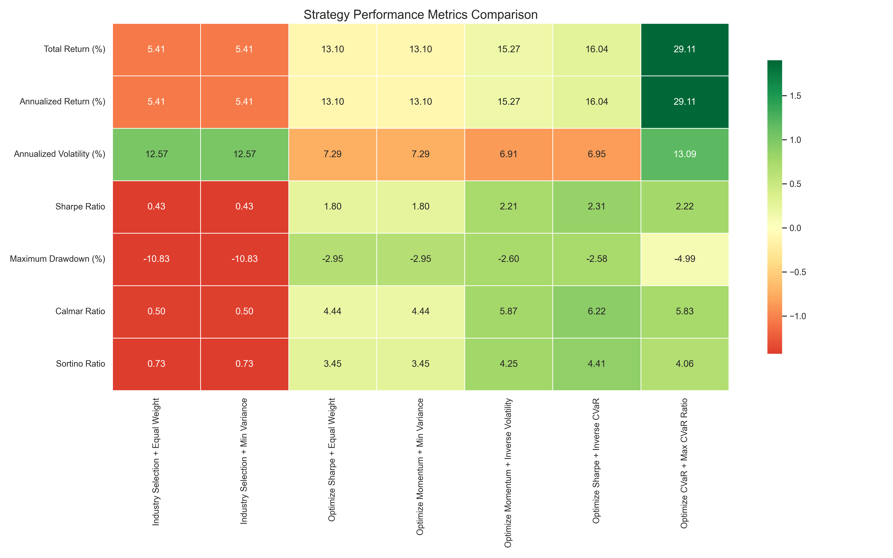
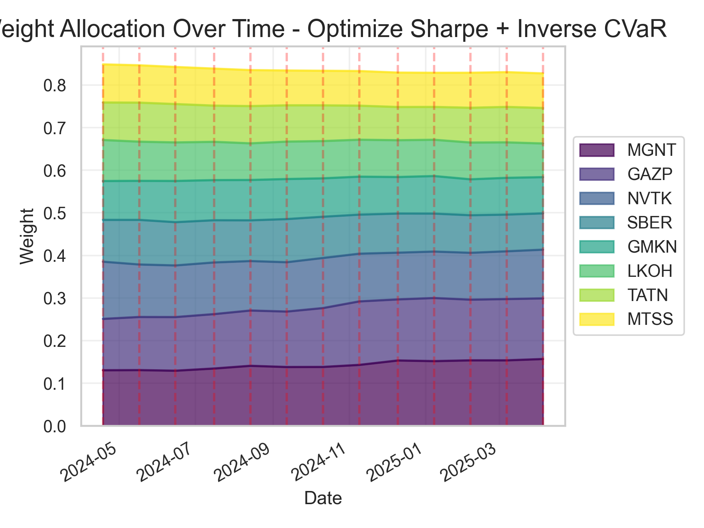

# Moscow Exchange Momentum Strategy

Торговая система для анализа российского фондового рынка и тестирования инвестиционных стратегий на Московской бирже.

## Описание проекта

Проект представляет собой платформу для:
- Анализа акций и индексов Московской биржи
- Тестирования различных стратегий выбора активов и аллокации
- Оценки производительности стратегий с учетом комиссий и затрат
- Визуализации результатов и формирования отчетов

## Основные компоненты

- **Price Service**: сервис для получения и работы с ценовыми данными
- **Portfolio**: класс для управления портфелем и тестирования различных стратегий
- **Corporate Event Fetcher**: модуль для получения информации о корпоративных событиях
- **Data Sources**: адаптеры для различных источников данных (MOEX API, Yahoo Finance и др.)

## Стратегии

Реализованы различные стратегии выбора активов:
- Секторальная ротация с равновзвешенной аллокацией
- Оптимизация по коэффициенту Шарпа
- Оптимизация по моментуму
- Оптимизация по волатильности
- Стратегии с минимизацией CVaR

## Примеры визуализаций

### Сравнение стратегий



### Анализ просадок



### Распределение доходностей



### Тепловая карта результатов



### Веса в портфеле



## Как использовать

### Установка зависимостей

```bash
pip install -r requirements.txt
```

### Запуск бэктеста

```bash
python scripts/backtest_demo.py
```

### Запуск Smart Beta стратегии

```bash
python scripts/smart_beta_strategy.py
```

## Отчеты

Система генерирует несколько типов отчетов:
- **Excel-отчеты**: детальные данные о производительности стратегий
- **HTML-отчеты**: интерактивные отчеты с визуализациями
- **Логи**: подробная информация о ходе выполнения операций

## Структура проекта

```
mos_exchange/
├── src/                           # Source code
│   ├── domain/                    # Domain layer (business logic)
│   │   ├── entities/              # Business entities
│   │   │   ├── __init__.py
│   │   │   ├── price.py           # Price data entity
│   │   │   ├── security.py        # Security/stock entity
│   │   │   ├── index.py           # Index composition entity
│   │   │   ├── portfolio.py       # Portfolio entity with selection/allocation methods
│   │   │   └── corporate_event.py # Corporate events entity
│   │   ├── interfaces/            # Abstract repositories & services
│   │   │   ├── __init__.py
│   │   │   ├── price_repository.py
│   │   │   └── data_source.py
│   │   └── services/              # Business use cases
│   │       ├── __init__.py
│   │       ├── price_service.py
│   │       └── index_service.py
│   ├── infrastructure/            # External interfaces implementation
│   │   ├── __init__.py
│   │   ├── data_sources/          # Data source implementations
│   │   │   ├── __init__.py
│   │   │   ├── moex_api.py
│   │   │   ├── yahoo_api.py
│   │   │   ├── tinkoff_api.py
│   │   │   └── finam_api.py
│   │   ├── repositories/          # Repository implementations
│   │   │   ├── __init__.py
│   │   │   ├── mongodb_repository.py
│   │   │   ├── sqlite_repository.py
│   │   │   └── csv_repository.py
│   │   └── utils/                 # Utility functions
│   │       ├── __init__.py
│   │       ├── date_utils.py
│   │       └── error_handling.py
│   └── application/               # Application layer
│       ├── __init__.py
│       ├── dto/                   # Data Transfer Objects
│       │   ├── __init__.py
│       │   └── price_dto.py
│       ├── services/              # Application services
│       │   ├── __init__.py
│       │   ├── price_fetcher.py
│       │   └── price_storage.py
│       └── config.py              # Application configuration
├── scripts/                       # Command-line scripts
│   ├── fetch_prices.py
│   ├── fetch_index.py
│   ├── backtest_demo.py          # Portfolio backtest demonstration
│   ├── price_adjustment_demo.py  # Price adjustment for corporate events
│   ├── rebalance_demo.py         # Portfolio rebalancing example
│   └── smart_beta_strategy.py    # Smart beta strategy implementation
├── tests/                         # Unit tests
│   ├── domain/
│   ├── infrastructure/
│   └── application/
├── results/                       # Generated results and visualizations
├── .gitignore
├── requirements.txt
└── README.md
```

## Clean Architecture Benefits

This structure provides several benefits:

1. **Separation of Concerns**: Each layer has a specific responsibility
2. **Dependency Rule**: Dependencies flow inward, domain layer has no external dependencies
3. **Testability**: Business logic is isolated and easily testable
4. **Flexibility**: Data sources and storage mechanisms can be changed without affecting business logic

## Installation

```bash
pip install -r requirements.txt
```

## Usage Examples

Fetch current index composition:

```bash
python scripts/fetch_index.py
```

Fetch price data for specific tickers:

```bash
python scripts/fetch_prices.py --tickers SBER,GAZP,LKOH --source yahoo --start-date 2023-01-01
```

Run a smart beta strategy backtest:

```bash
python scripts/smart_beta_strategy.py
```

## Data Sources

The application can fetch data from:

- **MOEX API**: Moscow Exchange official API for index compositions and price data
- **Yahoo Finance**: Global price data source with good historical coverage
- **Tinkoff API**: Russian broker API requiring authentication
- **Finam**: Russian financial data provider
- **Financial Modeling Prep**: Alternative global financial data API
- **Investing.com**: Web-based financial data source

## Contributing

Contributions are welcome! Please feel free to submit a Pull Request. 
This project is licensed under the MIT License - see the LICENSE file for details. 